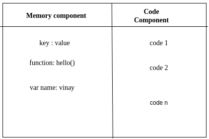
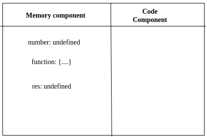

In this blog we will discusss about<br/>

1\. What is execution context?<br/>
2\. What makes JavaScript single threaded and synchronous? <br/>
3\. How code is executed in JavaScript?
<br/><br/>
**1. What is execution context?** <br/>
_Execution context is an container where all the code is executed._ <br/>

This execution context is divided into 2 parts.<br/>
1\. Memory or variable envirnoment.<br/>
2\. Code or thread of execution. <br/>

**1\.Memory component or variable envirnoment**<br/>
In memory part where all the variables and functions are stored in the form of key-value pairs something like dictionary in python.

**2\.Code component or thread of execution.**<br/>
In this code part where the actual code resides. These codes are executed in sequetial manner. JavaScript executes the code line by line.



**2. What makes JavaScript single threaded and synchronous?**<br/>
_JavaScript is synchronous and single-threaded language._ In the code component JavaScript executes code line by line and it follows the certain pattern.
It means second line of code is excuted after completing the execution of first line.<br/>

**3. How code is executed in JavaScript?**<br/>
Code execution in JavaScript takes place in execution context. This execution phase is divided into 2 phases.
<br/>

1\. Memory creation phase.<br/>
2\. Code execution phase.

1\. **Memory creation phase.**<br/>
Consider the below code snippet to understand these phases.

```
1. var number = 2;
2. function add(a, b) {
3.    var add_of_num = a + b;
4.      return add_of_num;
5. }
6.var res = add(2, -1);

```

JavaScript scans the entire code snippet first. In this phase it encounters a varibale in line 1. _Then it reserves the memory for a variable `number` and assigns the special value as `undefined`_. Then in line number 2 it encounter a _`function()` with name `add` and it stores the entire code for the `function() add`_. And in line 6 it reserves the memory for _`res variable` and assigns value a special value as `undefined`_<br/>

After completing the first phase execution context looks like this. <br/><br/>


**2\. Code execution phase.**<br/>
_In this phase it assigns the value `2` to the identifier `number` in the line 1_. After finishing line 1 execution it moves to the next line, here it encounters function and JavaScript finds nothing to execute here.Then it moves to the line number 6 and _finds a function name, and invokes the function._ <br/>
Now in _global execution context a new execution context is created inside the code component of global execution context._ This new execution context will again divided into 2 parts guess what? :sunglasses: <br/>
1\. Memory component<br/>
2\. Code component<br/>
