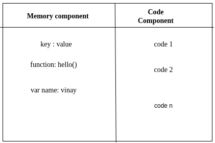
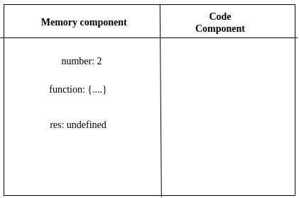
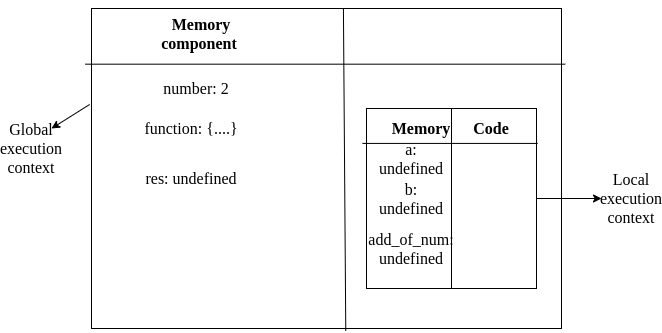
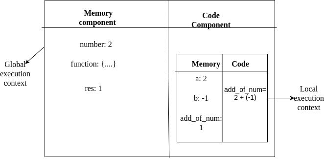

In this blog we will discusss about<br/>

1\. What is execution context?<br/>
2\. What makes JavaScript single threaded and synchronous? <br/>
3\. How code is executed in JavaScript?
<br/><br/>
**1. What is execution context?** <br/>
_Execution context is a container where all the code is executed._ <br/>

This execution context is divided into 2 parts.<br/>
1\. Memory component or variable environment.<br/>
2\. Code component or thread of execution. <br/>

**1\. Memory component or variable environment.**<br/>
In memory part where all the variables and functions are stored in the form of key-value pairs something like dictionary in python.

**2\. Code component or thread of execution.**<br/>
In this code part where the actual code resides. These codes are executed in sequential manner. JavaScript executes the code line by line.



**2. What makes JavaScript single threaded and synchronous?**<br/>
_JavaScript is synchronous and single-threaded language._ In the code component JavaScript executes code line by line and it follows the certain pattern.
It means second line of code is executed after completing the execution of first line.<br/>

**3. How code is executed in JavaScript?**<br/>
Code execution in JavaScript takes place in execution context. This execution phase is divided into 2 phases.
<br/>

1\. Memory creation phase.<br/>
2\. Code execution phase.

1\. **Memory creation phase.**<br/>
Consider the below code snippet to understand these phases.

```
1. var number = 2;
2. function add(a, b) {
3.    var add_of_num = a + b;
4.      return add_of_num;
5. }
6. var res = add(2, -1);
7. console.log(res)
```

JavaScript scans the entire code snippet first. In this phase it encounters a varibale in line 1. _Then it reserves the memory for a variable `number` and assigns the special value as `undefined`_. Then in line number 2 it encounter a _`function()` with name `add` and it stores the entire code for the `function() add`_. And in line 6 it reserves the memory for _`res variable` and assigns value a special value as `undefined`_<br/>

After completing the first phase execution context looks like this. <br/><br/>


**2\. Code execution phase.**<br/>
_In this phase it assigns the value `2` to the identifier `number` in the line 1_. After finishing line 1 execution it moves to the next line, here it encounters function and JavaScript finds nothing to execute here.Then it moves to the line number 6 and _finds a function name, and invokes the function._

After completing above process execution context looks like this.

<br/>
Now in _global execution context a new execution context is created inside the code component of global execution context._ This new execution context will again divided into 2 parts!! guess what? 🤔 <br/>
1\. Memory component<br/>
2\. Code component<br/>

This function again goes through 2 phase of execution.<br/>
1\. Memory creation phase<br/>
2\. Code execution phase<br/>

1\. Memory creation phase.<br/>
_In the memory creation phase identifier will get the special value called as `undefined` i.e in the line 2 function paramteres `a, b` will get the value as `undefined`_. This process is continued for the variable `add_of_num` also.<br/>

After the above process execution context looks something like this.



2\. Code execution phase.<br/>
Next phase is code execution phase. _In this phase `variable a, b` will get the value as `2, -1`_. Now control moves to the line number 3 in this line code is executed i.e _computation will take place inside the code component of the local execution context. And computed value is stored in variable_ `add_of_num`. In the line number 4 it _encounters a special keyword `return`, now this statement tells the JavaScript to return the controller back to the variable where this `function add()` is invoked._ Once it encounters a special keyword `return` in line number 4 code component will search for the variable `add_of_num` in the memory component replaces `undefined` value with computed value.

After code execution phase of a function execution context looks something like this.



Once function encounters special _keyword `return` it deletes the local execution context which is created for a `function add()`._ Now controll moves to the global execution context, i.e line number 6. And `res` will now hold the value as 1 and it prints the result to the `console`. _Once JavaScript finds all code is executed it deletes the global execution context._

To move the control back and forth JavaScript makes use of a very _familiar data structure called as Call Stack._<br/>

**Call Stack.**<br/>
Whenever the _JavaScript starts executing the code, a global execution context is created this global execution context is pushed inside the call stack_. Then JavaScript starts scanning the program. In this line number 6 in the above code snippet a `function add()` is invoked, as we have already discussed function will have separate execution context, this local execution context is again pushed on to the call stack when the function encounters a special keyword `return` inside the `function add()` this local execution context is popped from the call stack. And control is again moved to global execution context. _Once JavaScript completes the code execution this global execution context is popped from the call stack_ this how JavaScript makes use of stack data structure.

_Happy Coding !!!_

Reference <br/>
[Namaste JavaScript](https://youtu.be/pN6jk0uUrD8)

[Buy my products at Amazon](https://www.amazon.in/hz/wishlist/ls/1E3IEQOE8QNI0?ref_=wl_share&tag=vinaytech7-21)
